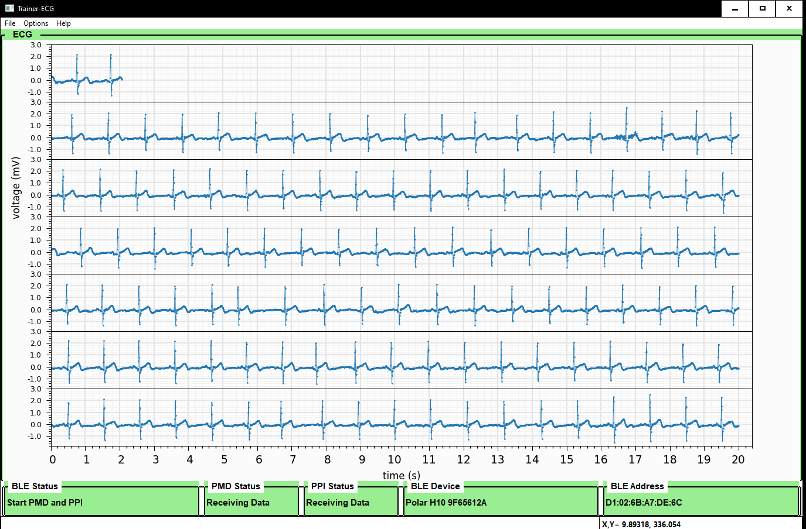

# Fitness HRV

The *Fitness HRV* family of apps are intended to provide a framework for logging and analysis of training data in real-time.

Currently there are two applications available in *Alpha* release:

- Fitness\_Dashboard
- Fitness\_ECG

## Fitness\_Dashboard

*Fitness\_Dashboard* captures *Ant+* and *BLE* dat from power meters, heart rate monitors, fitness trainers and various other devices. 

This is displayed in two ways. First a large set of graphs showing various statistics. Second a large display of the current values for the 
statistics from each device being monitored. The intent is to provide the equivalent of of a cycling computer with a much larger and easier
to read interface suitable for using when training indoors.

Currently supported:

- Ant+ Device Profiles
    - Heart Rate 
    - Bicycle Power
    - Fitness Equipment (FE-C)
    - Muscle Oxygen
    - Bicycle Speed and Cadence

## Fitness\_ECG

*Fitness\_ECG* captures heart rate and *ECG* data from a *Polar H10* heart rate monitor. This is displayed as an *ECG* trace and 
heart rate graph over time.

The application supports:
- paging forward and back through the ECG trace
- sizing the ECG trace 
- printing the currently displayed ECG trace to a PNG or PDF file
- recording the ECG and heart rate data to *CSV* files.

## Ant+ and BLE
There is a wealth of data available from our training devices, power meters, heart rate monitors, fitness trainers, etc.

These provide device specific data via *Ant+* and *BLE* using various standards. Typically *Ant+* devices broadcast data
and it is easy to capture the data without interference with other programs that are also using them. *BLE* devices are
more limited in the number of connections they support and will usually require pairing to work correctly.

